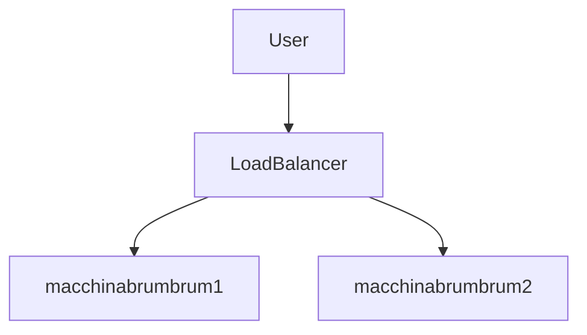

# Deploy di Web App ad Alta Disponibilità su Microsoft Azure
---
## Introduzione

Questa guida illustra come implementare una soluzione di alta disponibilità per una web app su Azure sfruttando Load Balancer e macchine virtuali Linux. La documentazione segue un approccio step-by-step e si rivolge sia a chi sta studiando Azure sia a chi intende creare ambienti resilienti in cloud.

## Obiettivo

Realizzare un'infrastruttura Azure composta da:
- Due VM Linux con web server Apache,
- Load Balancer pubblico con health probe,
- IP statico pubblico,
- Regole di sicurezza e failover automatico.

## Prerequisiti

- Sottoscrizione Azure attiva
- Permessi di Contributor o superiore nella sottoscrizione
- Familiarità con Azure Portal, SSH, e comandi di base Linux

## Architettura di riferimento



---

## Procedura dettagliata

### 1. Creazione del Resource Group

1. Accedi al Portale Azure.
2. Vai su `"Resource Groups"` → `"Create"`.
3. Imposta:
   - **Name:** `"inserisci nome risorsa"`
   - **Region:** `North Europe`
1. Completa la creazione.

---

### 2. Provisioning delle Virtual Machine (VM)

Per ciascuna VM (macchinabrumbrum1 e macchinabrumbrum2):

- **OS:** `Ubuntu Server 22.04 LTS`  
- **Size:** `B1s ` 
- **Authentication:** `Password`  
- **Virtual Network:** `VNet-WebApp`
- **Subnet:** `default`
- **Public IP:**` Statico, abilitato`  
- **Ports:** `22 (SSH), 80 (HTTP) ` 
- **DNS label:** `"nome a scelta".northeurope.cloudapp.azure.com`

---

### 3. Installazione Web Server sulle VM

Accedi via SSH a ciascuna VM:

**macchinabrumbrum1**
```bash
sudo apt update && apt upgrade -y
sudo apt install apache2 -y
echo "<h1>Web App Attiva - MACCHINA 1</h1>" | sudo tee /var/www/html/index.html
```

**macchinabrumbrum2**
```bash
sudo apt update && apt upgrade -y
sudo apt install apache2 -y
echo "<h1>Web App Attiva - MACCHINA 2</h1>" | sudo tee /var/www/html/index.html
```

Verifica l’accesso via browser agli IP pubblici/DNS di ciascuna VM.

---

### 4. Configurazione del Load Balancer

1. Vai su `"Create a resource"` → `"Networking"` → `"Load Balancer"`.
2. Imposta:
   - **Type:** `Public`
   - **SKU:** `Standard`
   - **Name:** `"inserire nome`
   - **IP Address:** `Statico`
3. Associa il Load Balancer alla VNet creata.

---

### 5. Configurazione dei Backend Pool

- **Name:** `"inserisci nome"`
- **Aggiungi:** `la-prima-macchina, la-seconda-macchina` 
- **Network:** `VNet-WebApp`

---

### 6. Configurazione Health Probe

- **Name:** `"inserisci nome"`
- **Protocol:** `HTTP`
- **Port:** `80`
- **Path:** `/`
- **Interval:** `5s`
- **Unhealthy Threshold:** `2`

---

### 7. Regole di Bilanciamento

- **Name:** `"inserisci nome"`
- **Frontend port:** `80`
- **Backend port:** `80`
- **Backend pool:** `Inserisci la backend-pool creata in precedenza`
- **Health probe:** -[`Inserisci la probe creata in precedenza`](6.-configurazione-health-probe)
- **Session persistence:** `None`

---

### 8. Configurazione Network Security Group (NSG)

Per ogni VM:
- **Inbound Rule:**  
  - **Name:** allow-http  
  - **Port:** 80  
  - **Protocol:** TCP  
  - **Source:** Any  
  - **Action:** Allow  

---

### 9. Test di Failover e Verifica

1. Accedi a `http://<IP_statico_del_LoadBalancer>` dal browser.
2. Spegni una delle due VM dal portale Azure.
3. Dopo 15-30 secondi, aggiorna il browser: il traffico sarà servito dalla VM attiva.
4. Riaccendi la VM spenta e verifica il ritorno del traffico bilanciato.

---

## Best Practice e Automazione

- **Automazione:**  
  Utilizza Azure CLI, ARM Template o Bicep per rendere ripetibile il deployment.
- **Sicurezza:**  
  Limita l’accesso SSH tramite IP specifici e valuta l’uso di Azure Bastion.
- **Monitoraggio:**  
  Abilita Azure Monitor e Log Analytics per verificare lo stato delle VM e del Load Balancer.
- **Scalabilità:**  
  Considera l’uso di Virtual Machine Scale Set per ambienti di produzione.

---
**Autore:** Jacopo Guerandi
